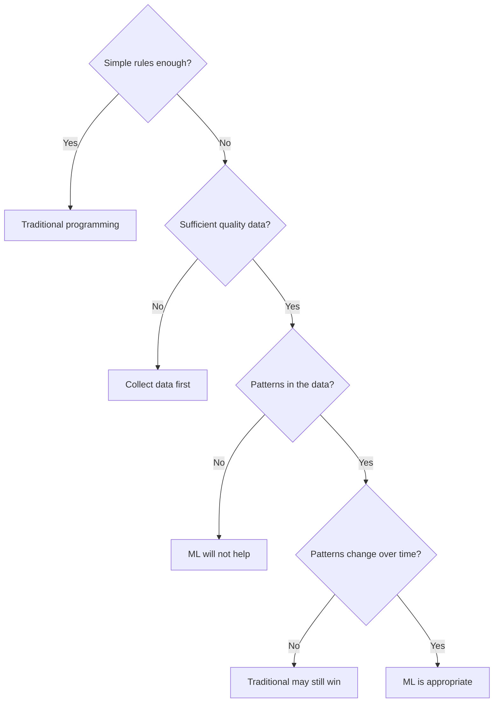
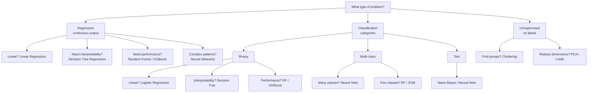
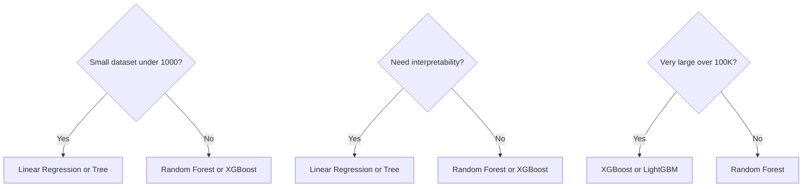
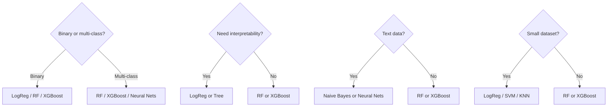
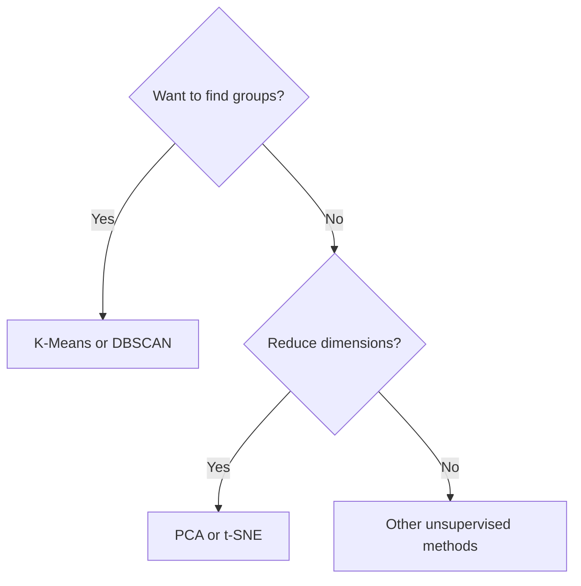

# Problem Identification and Algorithm Selection Guide

This guide covers identifying ML problems and selecting the right algorithms for your use case.

## Table of Contents

- [Is ML the Right Solution?](#is-ml-the-right-solution)
- [Problem Type Identification](#problem-type-identification)
- [Algorithm Selection Guide](#algorithm-selection-guide)
- [Decision Trees](#decision-trees)
- [Real-World Examples](#real-world-examples)
- [Common Mistakes](#common-mistakes)

---

## Is ML the Right Solution?

### When to Use ML

**Use ML when:**
- Problem is too complex for explicit rules
- Patterns exist but are hard to define
- Data is available and representative
- Problem requires adaptation to new patterns
- Solution needs to scale automatically

**Examples:**
- Image recognition
- Natural language understanding
- Recommendation systems
- Fraud detection

### When NOT to Use ML

**Don't use ML when:**
- Simple rule-based solution works
- Data is insufficient or poor quality
- Problem requires 100% accuracy (safety-critical)
- Interpretability is legally required
- Solution is cheaper/faster with traditional methods

**Examples:**
- Simple calculations
- Well-defined business rules
- Deterministic processes

### Decision Framework



---

## Problem Type Identification

### Step 1: Identify Output Type

**Question**: What are we trying to predict?

#### A. Continuous Value (Number)
→ **Regression Problem**

**Examples:**
- House price ($250,000)
- Temperature (72.5°F)
- Sales amount ($1,234.56)
- Time duration (3.5 hours)

**Characteristics:**
- Output is a real number
- Can be any value in a range
- Can perform arithmetic operations

#### B. Category/Class (Label)
→ **Classification Problem**

**Examples:**
- Email type (spam/not spam)
- Image category (cat/dog/bird)
- Disease diagnosis (healthy/sick)
- Customer segment (A/B/C)

**Characteristics:**
- Output is a discrete category
- Limited set of possible values
- Cannot perform arithmetic

#### C. No Clear Output (Pattern Discovery)
→ **Unsupervised Learning**

**Examples:**
- Customer groups (unknown)
- Anomalies in data
- Data structure discovery

**Characteristics:**
- No labels available
- Want to discover patterns
- Exploratory analysis

### Step 2: Check Data Availability

**Question**: Do we have labeled data?

#### Labeled Data Available
→ **Supervised Learning**
- Regression or Classification

#### No Labels Available
→ **Unsupervised Learning**
- Clustering or Dimensionality Reduction

#### Can Get Labels Through Interaction
→ **Reinforcement Learning**
- Agent learns from rewards

---

## Algorithm Selection Guide

### Decision Tree for Algorithm Selection



### Detailed Algorithm Guide

#### For Regression Problems

**1. Linear Regression**
- **When**: Linear relationship between features and target
- **Pros**: Simple, interpretable, fast
- **Cons**: Assumes linearity
- **Use Case**: House prices, sales forecasting

```python
from sklearn.linear_model import LinearRegression
model = LinearRegression()
```

**2. Decision Tree Regression**
- **When**: Non-linear relationships, need interpretability
- **Pros**: Interpretable, handles non-linearity
- **Cons**: Prone to overfitting
- **Use Case**: When you need to explain predictions

```python
from sklearn.tree import DecisionTreeRegressor
model = DecisionTreeRegressor(max_depth=5)
```

**3. Random Forest Regression**
- **When**: Non-linear, need good performance
- **Pros**: Good performance, handles non-linearity
- **Cons**: Less interpretable
- **Use Case**: Most regression problems

```python
from sklearn.ensemble import RandomForestRegressor
model = RandomForestRegressor(n_estimators=100)
```

**4. XGBoost / LightGBM**
- **When**: Need best performance, large datasets
- **Pros**: Excellent performance
- **Cons**: Less interpretable, more hyperparameters
- **Use Case**: Competitions, production systems

```python
from xgboost import XGBRegressor
model = XGBRegressor()
```

#### For Classification Problems

**1. Logistic Regression**
- **When**: Binary classification, linear decision boundary
- **Pros**: Simple, interpretable, fast
- **Cons**: Assumes linearity
- **Use Case**: Spam detection, medical diagnosis

```python
from sklearn.linear_model import LogisticRegression
model = LogisticRegression()
```

**2. Decision Tree**
- **When**: Need interpretability, non-linear boundaries
- **Pros**: Very interpretable, handles non-linearity
- **Cons**: Prone to overfitting
- **Use Case**: When explanations are required

```python
from sklearn.tree import DecisionTreeClassifier
model = DecisionTreeClassifier(max_depth=5)
```

**3. Random Forest**
- **When**: Need good performance, non-linear boundaries
- **Pros**: Good performance, handles non-linearity
- **Cons**: Less interpretable
- **Use Case**: Most classification problems

```python
from sklearn.ensemble import RandomForestClassifier
model = RandomForestClassifier(n_estimators=100)
```

**4. Support Vector Machine (SVM)**
- **When**: Small to medium datasets, clear separation
- **Pros**: Effective for high-dimensional data
- **Cons**: Slow on large datasets, less interpretable
- **Use Case**: Text classification, image classification

```python
from sklearn.svm import SVC
model = SVC(kernel='rbf')
```

**5. K-Nearest Neighbors (KNN)**
- **When**: Local patterns matter, small datasets
- **Pros**: Simple, no training phase
- **Cons**: Slow prediction, sensitive to scale
- **Use Case**: Recommendation systems, pattern matching

```python
from sklearn.neighbors import KNeighborsClassifier
model = KNeighborsClassifier(n_neighbors=5)
```

**6. Naive Bayes**
- **When**: Text classification, many features
- **Pros**: Fast, works well with many features
- **Cons**: Assumes feature independence
- **Use Case**: Spam detection, document classification

```python
from sklearn.naive_bayes import MultinomialNB
model = MultinomialNB()
```

**7. Neural Networks**
- **When**: Complex patterns, large datasets
- **Pros**: Can learn complex patterns
- **Cons**: Requires more data, less interpretable
- **Use Case**: Image recognition, NLP, complex problems

```python
from sklearn.neural_network import MLPClassifier
model = MLPClassifier(hidden_layer_sizes=(100, 50))
```

#### For Unsupervised Problems

**1. K-Means Clustering**
- **When**: Know number of clusters, spherical clusters
- **Pros**: Simple, fast, scalable
- **Cons**: Need to specify k, assumes spherical clusters
- **Use Case**: Customer segmentation, image compression

```python
from sklearn.cluster import KMeans
model = KMeans(n_clusters=3)
```

**2. DBSCAN**
- **When**: Unknown number of clusters, irregular shapes
- **Pros**: Finds arbitrary shapes, identifies outliers
- **Cons**: Sensitive to parameters
- **Use Case**: Anomaly detection, irregular clusters

```python
from sklearn.cluster import DBSCAN
model = DBSCAN(eps=0.5, min_samples=5)
```

**3. PCA (Principal Component Analysis)**
- **When**: Reduce dimensions, visualize data
- **Pros**: Preserves variance, interpretable
- **Cons**: Linear transformation only
- **Use Case**: Dimensionality reduction, visualization

```python
from sklearn.decomposition import PCA
model = PCA(n_components=2)
```

---

## Decision Trees

### Quick Decision Guide

#### Problem: Predict Continuous Value



#### Problem: Predict Categories



#### Problem: Find Patterns (No Labels)



---

## Real-World Examples

### Example 1: E-commerce Product Recommendation

**Problem**: Recommend products to customers

**Analysis:**
- **Output**: Product categories (classification) OR ratings (regression)
- **Data**: Customer history, product features
- **Labels**: Available (purchase history)

**Solution**: 
- **Collaborative Filtering** (unsupervised) OR
- **Classification** (recommend/not recommend) OR
- **Regression** (predict rating)

**Algorithm**: 
- Matrix Factorization (unsupervised)
- Random Forest (classification)
- Neural Networks (deep learning)

### Example 2: Medical Diagnosis

**Problem**: Diagnose disease from symptoms

**Analysis:**
- **Output**: Disease category (classification)
- **Data**: Symptoms, test results
- **Labels**: Available (doctor diagnoses)

**Solution**: Classification

**Algorithm**: 
- **Interpretability important** → Decision Tree or Logistic Regression
- **Performance important** → Random Forest or XGBoost
- **Complex patterns** → Neural Networks

### Example 3: Customer Segmentation

**Problem**: Group customers by behavior

**Analysis:**
- **Output**: Customer groups (clustering)
- **Data**: Purchase history, demographics
- **Labels**, not available

**Solution**: Unsupervised Learning - Clustering

**Algorithm**: 
- **Know number of segments** → K-Means
- **Unknown number** → DBSCAN or Hierarchical Clustering

### Example 4: Sales Forecasting

**Problem**: Predict next month's sales

**Analysis:**
- **Output**: Sales amount (continuous number)
- **Data**: Historical sales, features
- **Labels**: Available (past sales)

**Solution**: Regression

**Algorithm**:
- **Simple pattern** → Linear Regression
- **Complex pattern** → Random Forest or XGBoost
- **Time series** → ARIMA, LSTM (covered later)

---

## Common Mistakes

### Mistake 1: Using Complex Algorithm When Simple Works

**Wrong**: Using neural network for simple linear problem
**Right**: Start with Linear Regression, upgrade if needed

### Mistake 2: Wrong Problem Type

**Wrong**: Using classification for regression problem
**Right**: Identify output type first (continuous vs category)

### Mistake 3: Ignoring Data Characteristics

**Wrong**: Using algorithm that doesn't fit data size
**Right**: Consider dataset size when selecting algorithm

### Mistake 4, not Considering Interpretability Needs

**Wrong**: Using black-box model when explanations needed
**Right**: Use interpretable models (Decision Tree, Linear Regression) when required

### Mistake 5: Overlooking Data Quality

**Wrong**: Selecting algorithm without checking data quality
**Right**: Clean data first, then select algorithm

---

## Algorithm Comparison Table

| Algorithm | Type | Interpretability | Performance | Speed | Best For |
|-----------|------|------------------|-------------|-------|----------|
| Linear Regression | Regression | High | Medium | Fast | Linear relationships |
| Logistic Regression | Classification | High | Medium | Fast | Binary classification |
| Decision Tree | Both | Very High | Medium | Fast | Interpretability needed |
| Random Forest | Both | Medium | High | Medium | General purpose |
| XGBoost | Both | Low | Very High | Medium | Competitions, production |
| SVM | Classification | Low | High | Slow (large data) | High-dimensional data |
| KNN | Classification | Medium | Medium | Slow (prediction) | Local patterns |
| Naive Bayes | Classification | Medium | Medium | Fast | Text classification |
| Neural Networks | Both | Low | Very High | Slow (training) | Complex patterns |
| K-Means | Clustering | Medium | Medium | Fast | Known cluster count |
| PCA | Dimensionality | High | N/A | Fast | Visualization, reduction |

---

## Selection Checklist

Before choosing an algorithm, ask:

- [ ] What is the output type? (Continuous/Category/Pattern)
- [ ] Do I have labeled data?
- [ ] How much data do I have?
- [ ] Do I need interpretability?
- [ ] What is the data type? (Tabular/Text/Image)
- [ ] What are the performance requirements?
- [ ] What are the constraints? (Time, resources)

---

## Resources

- [Scikit-learn Algorithm Cheat Sheet](https://scikit-learn.org/stable/tutorial/machine_learning_map/index.html)
- [ML Algorithm Selection Guide](https://www.kaggle.com/getting-started/131455)

---

## Key Takeaways

1. **Start Simple**: Begin with simple algorithms (Linear/Logistic Regression)
2. **Understand Problem**: Identify output type and data characteristics
3. **Consider Constraints**: Interpretability, speed, data size
4. **Iterate**: Try multiple algorithms, compare performance
5. **Domain Matters**: Some algorithms work better for specific domains

---

**Try next:** Shortlist two algorithms with a reason each. Compare on the same validation split.


> [!RECALL]
> What should you decide before picking an algorithm?
>
> Problem type (output), data shape/size, and constraints like interpretability or latency.
