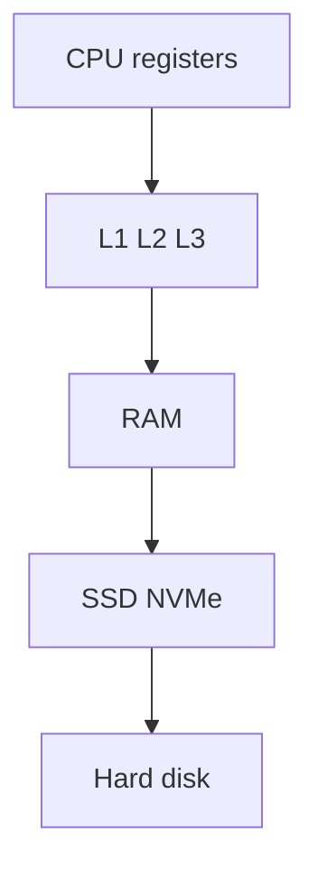
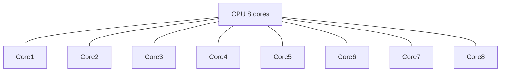
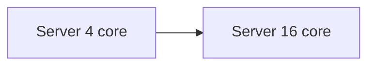

# 00. Computer Architecture

Before we talk about servers and load balancers, let's zoom in on a single computer. A server is just a fancy computer. If you understand how one machine handles work, the rest of system design feels less magical.

## The four layers of storage

A computer has a strict hierarchy of where it keeps data. Closer to the CPU means faster but smaller. Farther away means slower but cheaper and bigger.



A few sanity-check numbers worth memorizing:

| Layer              | Read time        | Capacity   | Notes                          |
| ------------------ | ---------------- | ---------- | ------------------------------ |
| L1 cache           | 1 ns             | ~64 KB     | per core                       |
| RAM                | 100 ns           | 16-256 GB  | volatile                       |
| SSD                | 100 microseconds | 1-4 TB     | survives reboot                |
| HDD                | 10 ms            | 4-20 TB    | spinning rust, slow random reads |
| Network round trip | 1-100 ms         | n/a        | depends on distance            |

Reading from RAM is roughly 100,000 times faster than reading from a spinning hard disk. An SSD is much closer to RAM than an HDD is (often on the order of ~1,000× slower than RAM for random reads, still far slower than DRAM). That's the gap a cache buys you.

## Why this matters for system design

When you put data in Redis, what you're really saying is "keep this in RAM so I don't pay the disk tax". When someone says "we serve from cache", they mean "the answer is sitting in RAM closer to the CPU than the database".

When you hear "this query is slow", nine times out of ten it's because the database has to leave RAM and go to disk.

## RAM vs disk: what's the difference really

RAM is volatile. Pull the plug, it's gone. It's fast because there are no moving parts and it's wired close to the CPU.

Disk is persistent. Even if the machine reboots, the data is still there. But traditional disks have a physical arm that needs to swing to the right spot. SSDs got rid of the arm. Which is why they're ~100x faster than HDDs.

Most databases (Postgres, MySQL, MongoDB) keep frequently-accessed data in RAM and write to disk for safety. It's the best of both worlds.

## The CPU and what cores really mean

A modern server CPU has somewhere between 4 and 128 cores. A core is essentially a mini-CPU that can run one task at a time.



More cores means you can do more things in parallel. But not everything benefits from parallelism. If task B needs the result of task A, you can't speed it up by adding cores.

This is also why Node.js. Which is single-threaded by default, sometimes feels limiting. One core does the work, the other 7 sit idle. You fix this with multiple processes (PM2 cluster mode, Kubernetes replicas, etc.).

## Moore's Law (and why we stopped caring)

For 40 years, CPUs got faster every 18 months. Now they mostly don't, because we've hit physical limits. Instead, chips ship more cores.

Implication for system design: you can't just buy a faster server. You need to design software that uses multiple cores, and multiple servers.

This is the whole reason horizontal scaling is the default in modern systems. We added machines because we couldn't add clock speed anymore.

## Vertical vs horizontal scaling

You'll hear this constantly. Two flavors of scaling:

**Vertical (scale up)**: bigger machine. More RAM, more cores, faster SSD. Easy to do. Hits a ceiling. Single point of failure.

**Vertical scaling**:


**Horizontal (scale out)**: more machines. No ceiling. Way more complexity (now you need load balancers, replication, etc.).

**Horizontal scaling**:


The realistic answer is "both". Start by vertical scaling because it's free engineering effort. When that runs out, you go horizontal.

## A quick code thing: cache locality

Even within one program, the memory hierarchy matters. Contiguous layouts (C arrays, NumPy) reward walking memory in order. Nested Python lists are not one contiguous block, so the same idea is clearer in NumPy:

```python
import numpy as np

N = 5_000
matrix = np.ones((N, N), dtype=np.float64)

# Row-major (fast on C-order arrays): walk memory in order
total = matrix.sum()  # NumPy uses contiguous access under the hood

# Column-strided access is often slower on huge C-order arrays
total = 0.0
for col in range(N):
    total += matrix[:, col].sum()
```

The gap is workload-dependent. The CPU's cache loads memory in chunks. If your access pattern matches that, you stay hotter in cache. If it jumps around, you keep going back to RAM.

System design version of this rule: keep related data together. It's why we denormalize tables, batch network calls, and group writes.

## Things to remember

- Memory hierarchy: registers > cache > RAM > SSD > HDD > network.
- Going to RAM is ~100,000x faster than going to a spinning disk (HDD). SSD is slower than RAM but much faster than HDD.
- A server has many cores. Plan to use them, or you waste hardware.
- Vertical scaling is easy and limited. Horizontal scaling is hard and has a much higher ceiling.

## Going deeper

- *Computer Architecture: A Quantitative Approach* by Hennessy & Patterson. The textbook.
- Brendan Gregg's "Systems Performance" book and his blog: https://www.brendangregg.com/. Famous for the latency numbers chart.
- "Latency Numbers Every Programmer Should Know" by Jeff Dean: https://gist.github.com/jboner/2841832.
- Crash Course on YouTube has a great series on CPU architecture if you like videos.
