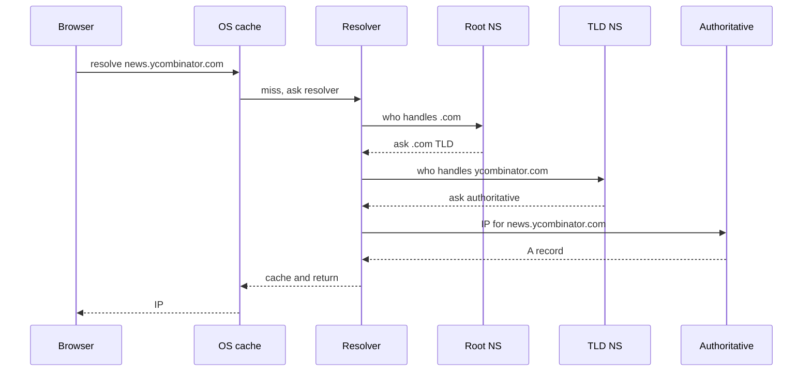
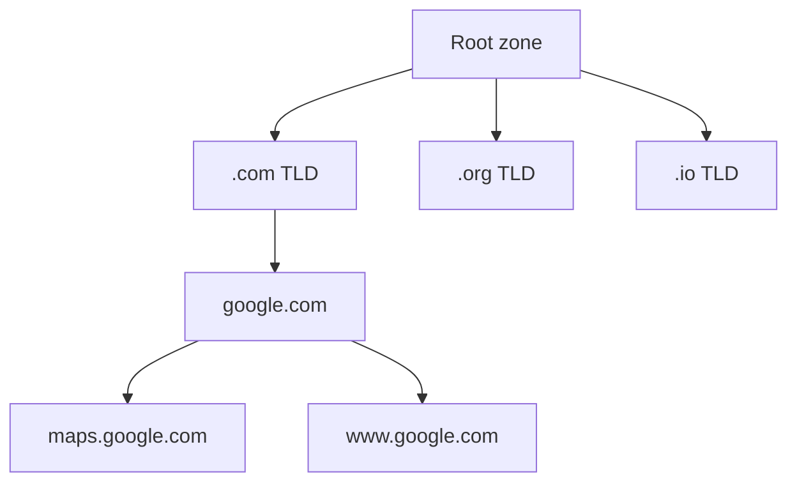

# 05. DNS

You type `google.com`. Your browser needs an IP address to connect to. The translation from name to number is what DNS does.

DNS is the phone book of the internet. It's also one of the most fragile systems on the internet because everything else depends on it.

## The lookup, step by step

When you visit `news.ycombinator.com`, your browser does roughly this:



Sounds slow. It would be, except every step caches aggressively. After the first lookup, the answer sits in caches for minutes to hours, depending on the **TTL** (time to live) on the record.

You can watch this happen:

```bash
dig news.ycombinator.com

# Or short form
nslookup news.ycombinator.com
```

You'll see the IP, the TTL, and how long the lookup took.

## The hierarchy

DNS is a tree.



Each level knows only the level below it. Root knows who handles `.com`. The `.com` servers know who handles `google.com`. Google's nameservers know what `maps.google.com` resolves to.

This is what makes DNS scalable. No one server has to know every domain.

## Common record types

DNS isn't just IP addresses. A domain can have several kinds of records:

| Record | Meaning |
|---|---|
| `A` | IPv4 address |
| `AAAA` | IPv6 address |
| `CNAME` | Alias to another name (e.g. `www.example.com -> example.com`) |
| `MX` | Mail server |
| `TXT` | Free-form text (used for SPF, DKIM, domain verification) |
| `NS` | Which servers are authoritative for this domain |
| `SOA` | Administrative info (zone serial, refresh rate) |

Try it:

```bash
dig google.com A          # IPv4
dig google.com AAAA       # IPv6
dig google.com MX         # mail
dig google.com TXT        # text records
dig google.com NS         # nameservers
```

You'll see Google has multiple `A` records (for redundancy and DNS-based load balancing).

## TTL: why DNS changes feel slow

Every record has a TTL telling resolvers "you can cache this for N seconds". Long TTLs (24 hours) mean fast lookups for users but slow propagation when you change something. Short TTLs (60 seconds) propagate quickly but mean more lookups.

When you switch DNS providers or move a website, you typically lower the TTL hours or days in advance so the change rolls out fast. After the change settles, you raise it back.

A common mistake: changing an A record from one IP to another with a 24-hour TTL, and being surprised that some users still hit the old IP a day later. That's not a bug. That's the cache doing its job.

## DNS-based load balancing

Big sites return multiple A records and shuffle the order. The client usually picks the first one. So if Google's resolver gives you:

```
google.com.   142.250.80.46
google.com.   142.250.80.78
google.com.   142.250.80.110
```

Different users get different IPs and load is roughly balanced.

There's also **GeoDNS**: the resolver returns different IPs based on your location. A user in Mumbai gets a server in Mumbai. A user in São Paulo gets one in São Paulo. This is how CDNs put the right server close to you (we'll cover that in Chapter 11).

## DNS as an attack surface

Because everything depends on DNS, it's a juicy target.

- **DNS hijacking**: change a record to point users at a malicious IP.
- **DNS amplification**: small UDP query, big UDP reply, all spoofed at one victim. Classic DDoS.
- **DNS over plaintext**: by default, DNS queries are unencrypted. Anyone on the path can see what you're looking up.

Modern resolvers (1.1.1.1, 8.8.8.8) support **DNS over HTTPS (DoH)** or **DNS over TLS (DoT)**, which encrypt the queries. Many browsers support DoH. Some enable it by default or via the resolver you pick. It is not universal.

## Code: a DNS lookup in Python

You don't normally talk to DNS directly. The standard library does it for you:

```python
import socket

ip = socket.gethostbyname("github.com")
print(ip)   # something like 140.82.114.4
```

For richer queries you can use `dnspython`:

```python
import dns.resolver

answers = dns.resolver.resolve("github.com", "A")
for r in answers:
    print(r.to_text())
```

## What gets cached, and where

- **Browser cache**: tiny, seconds to minutes.
- **OS cache** (systemd-resolved, macOS DNS cache): minutes.
- **Router cache**: minutes to hours.
- **ISP resolver cache**: hours.
- **Authoritative server**: source of truth, TTL-controlled.

When you "flush DNS" on your machine, you're clearing the OS cache only. The ISP still has its own copy.

```bash
# macOS
sudo dscacheutil -flushcache; sudo killall -HUP mDNSResponder

# Linux (systemd)
sudo systemd-resolve --flush-caches

# Windows
ipconfig /flushdns
```

## Things to remember

- DNS converts names to IPs through a hierarchy: root, TLD, authoritative.
- Caching everywhere is what makes DNS fast.
- TTL controls how long answers are cached. Lower it before changing things.
- Big sites use multiple A records and GeoDNS for cheap load balancing.
- DNS is plain UDP by default. DoH/DoT encrypts it.

## Going deeper

- *DNS and BIND* by Cricket Liu. The book.
- Julia Evans' DNS zine and articles: https://jvns.ca/. Hard to beat for clarity.
- Cloudflare Learning: https://www.cloudflare.com/learning/dns/what-is-dns/.
- RFC 1035 (the actual DNS spec), if you ever want to suffer: https://datatracker.ietf.org/doc/html/rfc1035.
