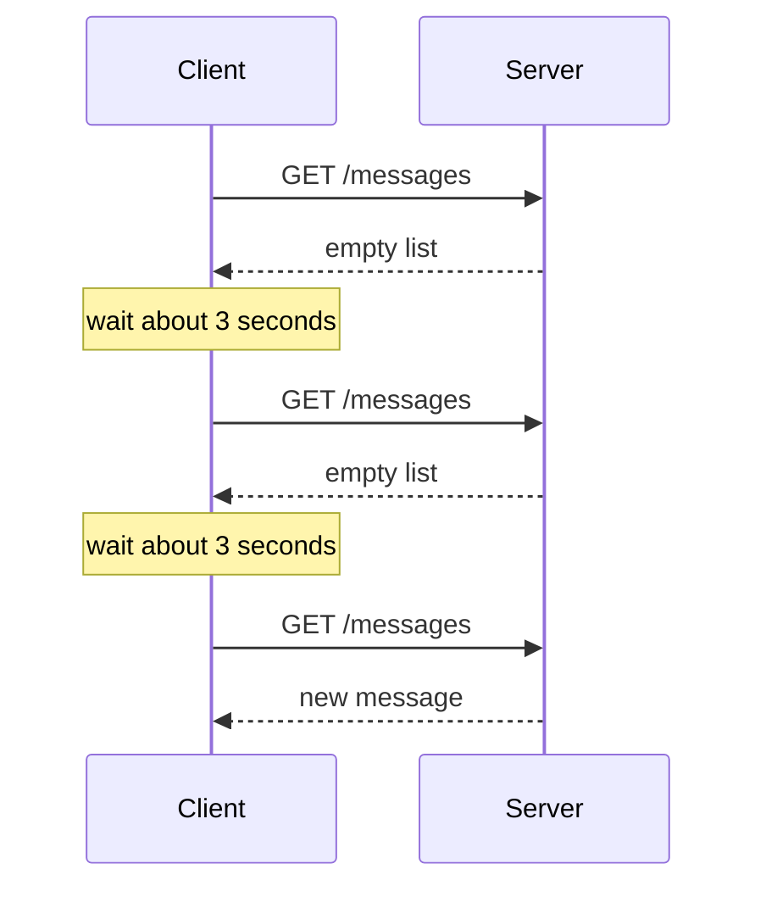
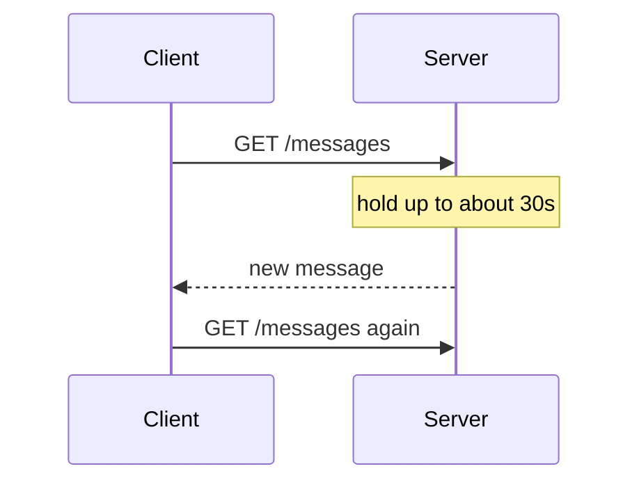
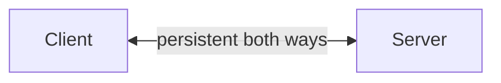
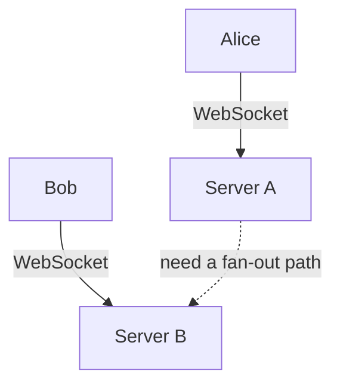
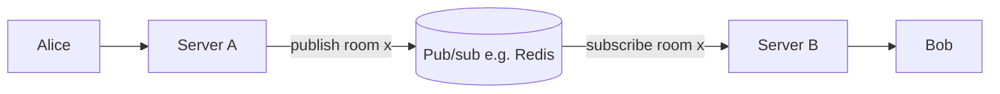

# 07. WebSockets

HTTP is request-response. The client asks, the server answers, the connection closes (or stays open for the next request). It works great for loading pages.

It works badly when the server needs to push something to the client. Chat messages, stock prices, live game state. The server can't just call the browser.

There are two ways to fake it with HTTP, and one real way to do it. The real way is WebSockets.

## The fakes (and why they hurt)

### Polling

The client asks every few seconds: "anything new?"



Simple. Wasteful. Latency capped at the polling interval. Bandwidth proportional to user count, not to messages.

### Long polling

Smarter. The client asks, the server holds the connection open until it has something to say.



Better latency, fewer requests, but it's still HTTP. Every reply closes the connection and a new one opens.

### Server-Sent Events (SSE)

Server can stream data over a single HTTP connection, but only in one direction (server to client). Good for live dashboards and notifications. Doesn't work for chat where the client also needs to send.

## WebSockets: a real two-way pipe

A WebSocket starts as an HTTP request that says "actually, let's upgrade this to a different protocol":

```
GET /chat HTTP/1.1
Host: example.com
Upgrade: websocket
Connection: Upgrade
Sec-WebSocket-Key: dGhlIHNhbXBsZSBub25jZQ==
Sec-WebSocket-Version: 13
```

The server replies with 101:

```
HTTP/1.1 101 Switching Protocols
Upgrade: websocket
Connection: Upgrade
Sec-WebSocket-Accept: s3pPLMBiTxaQ9kYGzzhZRbK+xOo=
```

After that the same TCP connection is no longer HTTP. It's a full-duplex pipe where either side can send small framed messages anytime.



The connection stays open until someone closes it. Could be hours. Could be days.

## When to use WebSockets

- Real-time chat (Slack, Discord, WhatsApp web).
- Multiplayer games.
- Live trading dashboards, sports scores, crypto prices.
- Collaborative editing (Google Docs, Figma cursors).
- Live notifications.

When **not** to use them:
- Loading a page. That's HTTP.
- Periodic checks every minute or more. Polling is fine.
- One-way streams. SSE is simpler.

## Code: chat in the browser

JavaScript side:

```js
const ws = new WebSocket("wss://example.com/chat");

ws.onopen = () => {
  console.log("connected");
  ws.send(JSON.stringify({ type: "hello", name: "Ada" }));
};

ws.onmessage = (event) => {
  const msg = JSON.parse(event.data);
  console.log("got:", msg);
};

ws.onclose = () => console.log("disconnected");
```

Server side in Python with `websockets`:

```python
import asyncio, json
import websockets

clients = set()

async def handler(ws):
    clients.add(ws)
    try:
        async for raw in ws:
            msg = json.loads(raw)
            # broadcast to everyone else
            for client in clients:
                if client is not ws:
                    await client.send(json.dumps(msg))
    finally:
        clients.remove(ws)

async def main():
    async with websockets.serve(handler, "0.0.0.0", 8000):
        await asyncio.Future()  # run forever

asyncio.run(main())
```

That's a working broadcast chat in 15 lines.

## Scaling WebSockets (the hard part)

This is where WebSockets get interesting. One server can hold maybe 50,000 to 500,000 open connections (depends on tuning, OS limits, memory). After that, you need to shard across many servers.

Problem: if Alice is connected to server A and Bob is on server B, how does Alice's message reach Bob?



You can't just put a load balancer in front and call it done. The servers need a way to talk to each other.

The standard answer: a **pub/sub** layer in the middle. Redis pub/sub is the common starter pick. Each WebSocket server subscribes to channels. When server A receives a message for room "x", it publishes to channel "x". Server B is listening to "x" and forwards to its connected users.



At very large scale you replace Redis with Kafka, RabbitMQ, or NATS. We'll come back to message queues in Chapter 19.

## Watch out for

- **Sticky sessions**: a WebSocket lives on one server, so after the upgrade the load balancer should keep that client on the same backend (sticky sessions or reconnect affinity). Plain round-robin on every packet is wrong. Round-robin on *new* connections can still work if each connection sticks afterward.
- **Memory per connection**: even an idle WebSocket has buffer overhead. 100k connections × 10 KB = 1 GB just for the sockets.
- **Heartbeats**: NAT routers and corporate firewalls love to silently drop idle TCP connections. Send a ping every 30 seconds to keep the line warm.
- **Authentication**: there's no second HTTP request, so all auth has to happen during the initial handshake. Usually you pass a token in the URL or as a cookie.

## Alternatives worth knowing

- **Server-Sent Events (SSE)**: HTTP one-way streaming. Browser support is good. Use when you don't need client-to-server messages.
- **WebRTC**: peer-to-peer between browsers, often over UDP. Used for video calls. Complex but very low latency.
- **gRPC streaming**: bidirectional streams over HTTP/2. Common in backend-to-backend communication, not browser-to-server.
- **MQTT**: pub/sub designed for IoT, also persistent connection. Tiny payloads.

## Things to remember

- HTTP is request-response. WebSockets are a persistent two-way pipe.
- Start with HTTP. Switch to WebSockets only when you really need server push.
- Scaling them needs a shared pub/sub layer between servers.
- Sticky sessions, heartbeats, and per-connection memory are the gotchas.
- For one-way streaming, SSE is simpler.

## Going deeper

- RFC 6455 (WebSocket spec): https://datatracker.ietf.org/doc/html/rfc6455.
- "Scaling WebSockets to 12 Million Concurrent Connections" (Phoenix Channels): https://www.phoenixframework.org/blog/the-road-to-2-million-websocket-connections.
- Socket.IO docs (popular JS lib): https://socket.io/. Handles fallback to long polling.
- Slack's engineering blog on real-time messaging: https://slack.engineering/.
